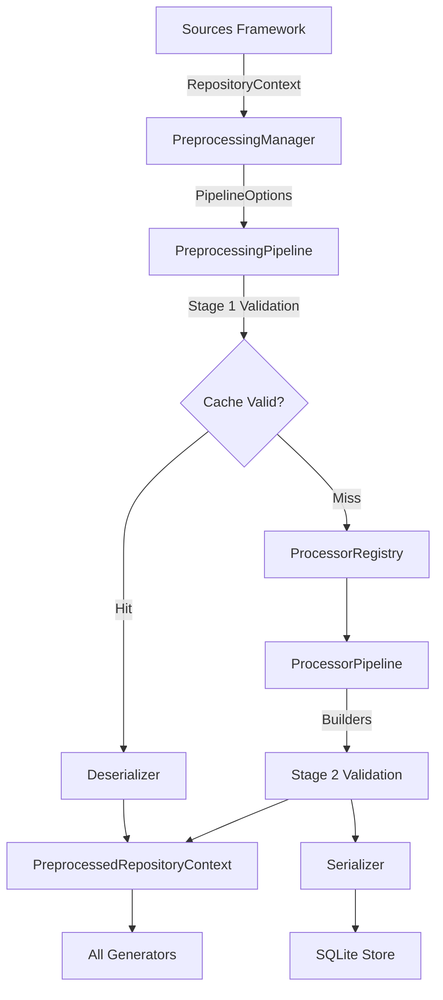

# Preprocessing Architecture v1.0.0

## High-Level Architecture
The AIODOO Preprocessing Framework acts as the canonical normalization layer between the raw Odoo Source repositories and the AIODOO Dataset Generators.

## Core Principles
1. **Total Immutability**: `ProcessorContext` instances are cloned using `with_update`, completely destroying mutability bugs.
2. **Determinism**: A `RepositoryContext` hash will ALWAYS produce the exact same `PreprocessedRepositoryContext` hash, thanks to explicit Priority sorting in the `ProcessorRegistry`.
3. **Stateless Processing**: Processors (`WhitespaceProcessor`, `PythonProcessor`, etc.) maintain no internal state between pipeline executions.
